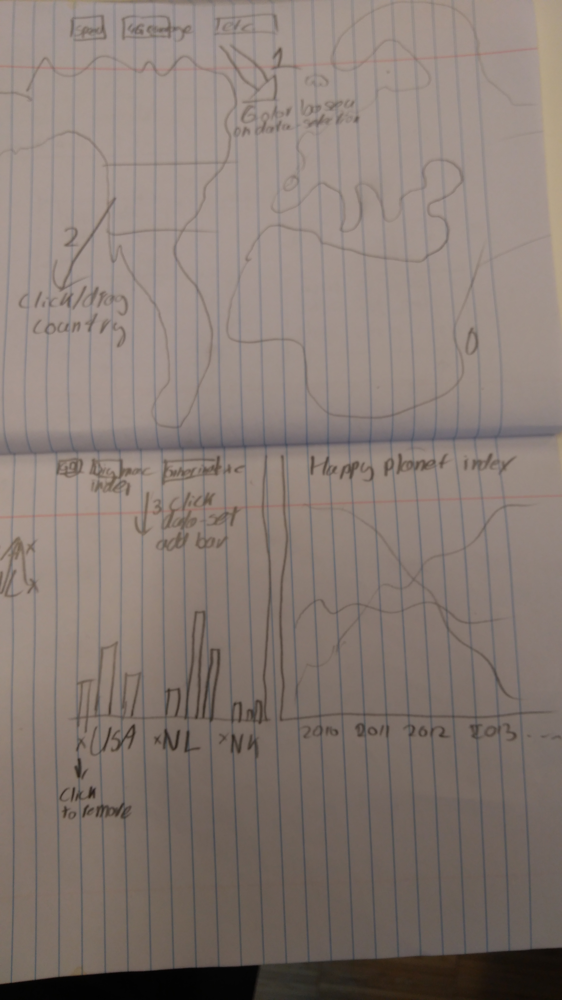

# Design
## Data sources
* [GDP and other economic factors](https://data.oecd.org/gdp/gross-domestic-product-gdp.htm)
** This site has a lot of extra statistics which I want to make use of. The above page is just an example
* [Happy planet index](http://happyplanetindex.org/)
* [The inclusive internet index](https://theinclusiveinternet.eiu.com/)
Data sources should be indexed on the country they belong to. All of these datasets are already ordered on the country theey belong to, so this should be fairly easy.

## Technical components

The idea is that users first select a variable about internet quality with which the map will be colored. After this they can click (perhaps drag) the country to add it to both plots below the map.

The first plot will be a grouped bar chart in which each group represents a selected country. Users can select which variables about welfare they want to show in the bar chart (perhaps limited to avoid scaling issues).

Next to the bar chart will be a multi-line chart displaying the Happy Planet Index for the selected countries over the last years.

## Implementations needed
* Structure in which the selected countries will be stored, so this can be used by all visualizations. 
* Controllers for each visualization
* Extra: way to make the countries draggable from the map to the graphs.

## List of libraries
* [D3-datamaps](http://datamaps.github.io/)
* [D3-tip](https://github.com/Caged/d3-tip)
* [jQuery](https://jquery.com/)
* [Bootstrap](https://getbootstrap.com/)
* [dragit](https://github.com/romsson/dragit)
