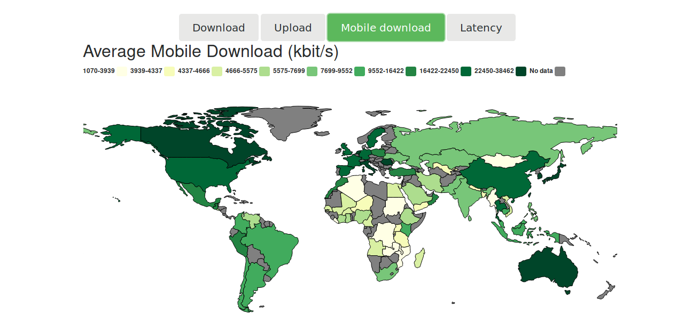
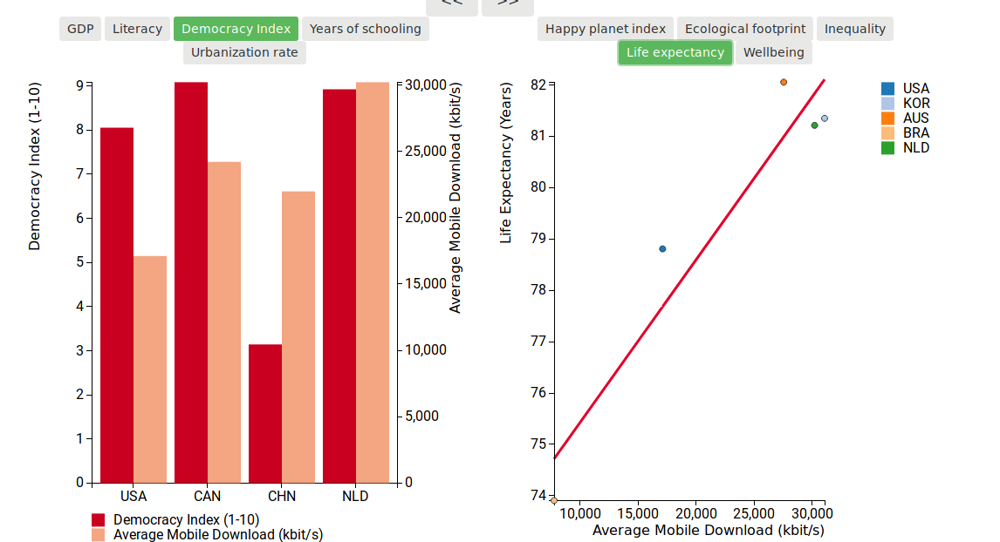

# Programmeerproject
Name: Sebastiaan Arendsen

## Links
[Github page](https://flewtje.github.io/progProject/app/index.html)
[Youtube Video](https://youtu.be/fcqf2oT0lbo)
### Data sources
[Happy Planet Index](https://happyplanetindex.org/)
[Inclusive Internet Data](https://theinclusiveinternet.eiu.com/)

## Problem statement
I wanted to visualize the importance of internet access to the welfare of a country. In these modern times internet acces is vital to the productivity in a country and their access to information. Welfare of a country can be quantized in different ways.

With this visualization I wanted to see what influences there were on internet speed, but also the other way around.

## Solution
The way this is achieved is by using three different plots. A datamap showing the chosen internet data in a colored field.

Countries can be dragged to two different plots below the datamap.

### Main features
* A datamap
* Ability to drag map elements to the other plots.
* All three plots have the ability to show different types of data variables.
* A double y-axis grouped bar chart showing internet data and a chosen variable about an economic factor.
* A scatterplot with a regression line showing the selected Happy Planet Index versus the Internet quality.
* Buttons to transfer countries between the two plots.

## Libraries used
* d3
* d3-tip
* d3-legend
* topojson
* d3-datamap
* bootstrap
* jQuery
